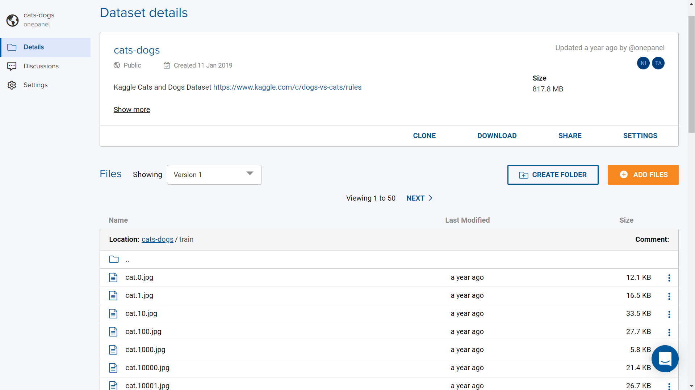

# Datasets Overview

Datasets are containers that stores most kinds of data ranging from images, videos, texts and even training model outputs.

Additionally, CVAT model training output is automatically stored under a dataset when completed, this way users can [mount](mount.md) models easily in any of their running workspaces.

Optionally you can store using [AWS](create-aws.md), [Google Cloud](create-google.md), [Kaggle](create-kaggle.md) and [Google Drive](create-google.md).

Datasets can accomodate very large data ranging from GB to TB, if you require a specific custom dataset size you can send us an email at info@onepanel.io

