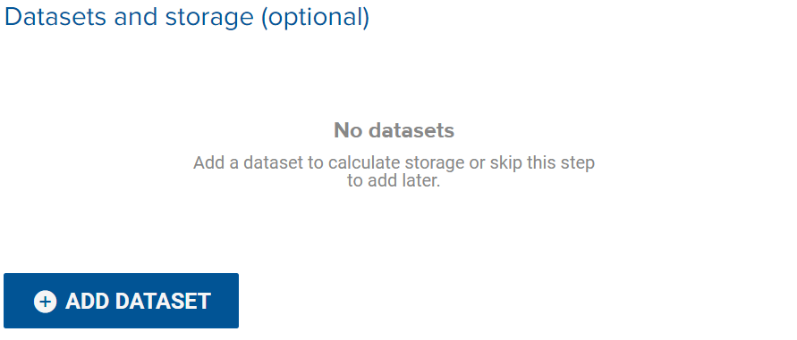

There are two ways to mount a dataset

#### Mount in a Running Workspace
1. Click the Workspace name in the active tab.
2. Click Add Dataset
3. Type name of dataset to mount

#### Mount when Initiating a Workspace
1. Create a Workspace
2. Under workspace details > Datasets and Storage > click Add Dataset
3. Type name of dataset to mount

Note:  
You can mount multiple datasets at once, make sure workspace storage size is sufficient