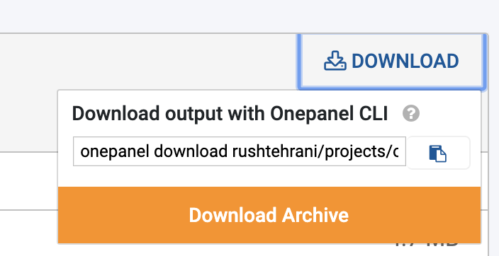

You can download Job output through the web interface, CLI or SDK.

## Download Job output from web interface

1. Click on a Job.
2. Click on the **Output** tab.

3. Click **Download** and then click **Download Archive**

4. You can also navigate to any file in file browser and download it individually by clicking the **Download** button.

## Download Job output from CLI

!!!tip Tip
    See [onepanel download](/cli/download/#jobs) command for examples and more information.

1. Click on a Job.
2. Click on the **Output** tab.

3. Click **Download** and then click <i class="fa fa-clipboard"></i> to copy the CLI command.

4. Paste the CLI command into your terminal.
