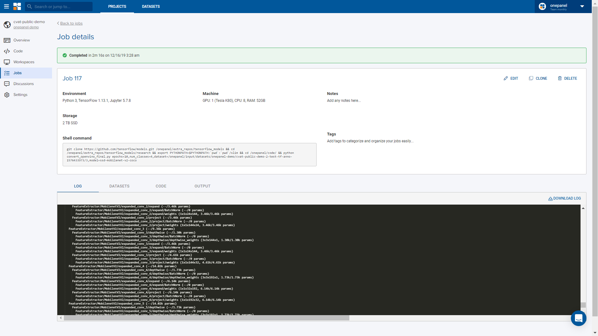

!!! note "Note" 
    You can turn off machine or log out from Onepanel as Job instances will continue to run under your account.

Jobs are Linux terminal environment you can use to train in parallel - meaning you can run separate training instances with different parameters producing models with the best accuracy.  While training you can view [tensorboard metrics](/jobs/tensorboard) - a feature that provides visualization and tooling needed for machine learning experimentation.  
Finally, users can [download outputs](/jobs/download-output), which requires users to adjust their script to [save outputs](/jobs/save-output) in a specific folder.

