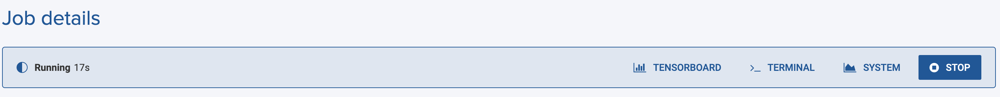

## Save TensorBoard logs

You can use TensorBoard in Onepanel by placing your log file into the following folder:

```bash
/onepanel/output
```

### PyTorch
```python
from tensorboardX import SummaryWriter

# Save logs to `/onepanel/output`
writer = SummaryWriter('/onepanel/output')
...
writer.add_scalar('Accuracy', accuracy, iteration)
```

### TensorFlow
```python
import tensorflow as tf

# Save logs to `/onepanel/output`
tensorboard = tf.keras.callbacks.TensorBoard(log_dir='/onepanel/output', batch_size=32, write_images=True)
...
model.fit(x_train, y_train, epochs=10, callbacks=[tensorboard])
```

## View TensorBoard

You can view TensorBoard for a running job by clicking **TensorBoard** in Job details:




