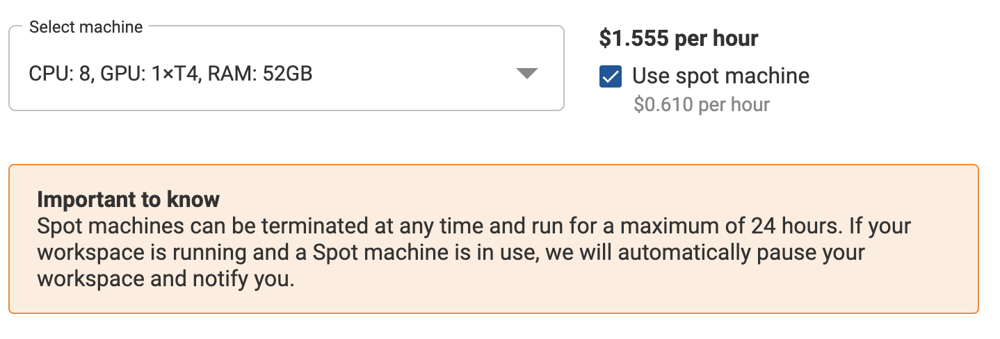

Spot machines are highly affordable, short lived machines. They can be terminated at any time and run for a maximum of 24 hours. If your Workspace or Job is running and a Spot machine is in use, we will automatically pause your workspace and notify you.

## Select Spot on creation
When creating a Workspace or Job, check the box next to **Use spot machine**.

## Switch to Spot in running Workspace
To switch a Workspace to a Spot machine type:

1. Click the Workspace name in the active tab.

2. Click the <i class="fa fa-pencil"></i> icon next to **Machine**.

3. Check the **Use spot machine** checkbox.

4. Click **Restart**.