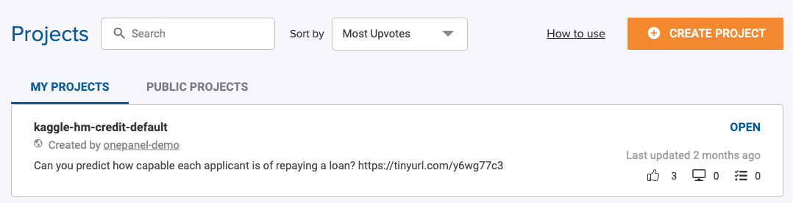
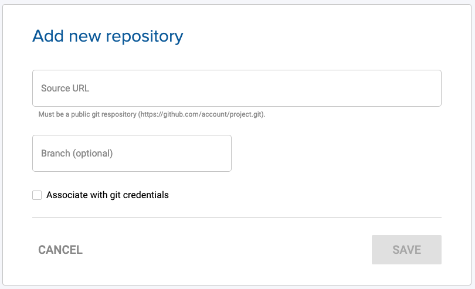

You can create a project from the web interface or using the CLI.

!!! note "Note"
    To create a project via the CLI [see these instructions](/cli/projects-create)
    

To create project using the web interface:

1. Go to **Projects** and click **Create Project**.

2. Next, you can choose to **Use a starter project** or **Create your own project**.

If you pick to start with a starter project, you can select a project from the list and click **Next** to get started. The project **visibility** will be set to private.

3. If creating your own project, enter the name, description and pick the visiblity for your project. Project naming criteria are as follows:
    - 3 to 25 characters
    - Lower case alphanumeric, `-` or `_`
    - Must start and end with alphanumeric
    
    

4. Optionally, enter the repository URL and optionally the branch name. URL format: `https://github.com/account/project.git`.

5. Optionally and if this is a private repository, select **Associate with git credentials**. Select an existing or click **Add new credentials** to add and associate new credentials.

6. Optionally, you can import this external repository to the Project's [Local Repository](/projects/epositories/#local-repository) by selecting **Import this repository to Onepanel**.

7. Click **Create**.