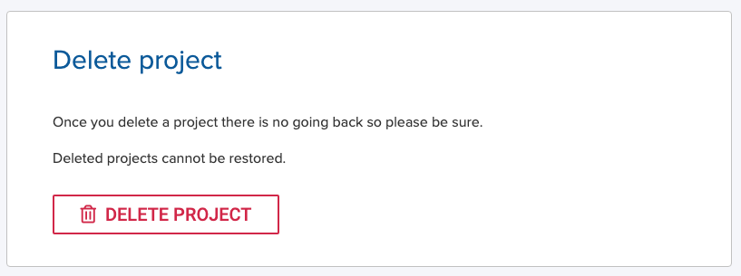

!!! warning "Warning"
    Deleted projects cannot be restored.

!!! note "Note"
    If you have running Workspaces or Jobs, you have to stop them first before deleting a project.

To delete a Project:

1. Go to a Project and click **Settings** in the side menu or in the project overview card.
2. Click **Delete Project**. You will be prompted to confirm.
