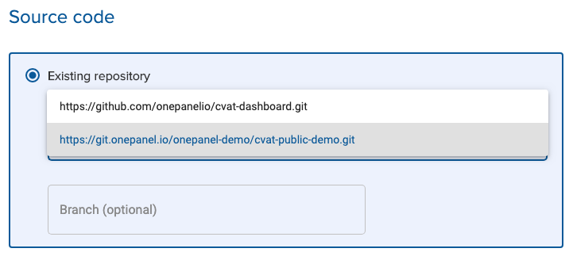

!!! tip Tip
    You can identify **Local Repositories** by their domain https://git.onepanel.io

Each project comes with its own **Local Repository**, which is a Git repository managed by Onepanel. This repository is special because once you add a project member, they can automatically pull from and push to this repository instead of having to manage their credentials separately. Once you remove a member from a project, they are also removed from this repository. Other than these special properties, you can treat this repository just like your other Git repositories.


## Using a Local Repository

### In a Workspace

In a Onepanel Workspace, you can simply select this repository:



It will then be available in your `code` folder. You can then add and commit files and push to it:

```bash
# add and commit your files
git push
```

### On your local machine

First, you need to get your git credentials for this repository:

1. In top right corner, click your username and then click **Account**
2. Click **Git credentials**
3. Next to **local-repository-token**, click **SHOW** to view your password

4. Use this username and password in your `git clone/push` commands.

You can then clone this repository:

```
git clone https://git.onepanel.io/<account>/<project>.git
```

Or, add it at as a remote to an existing repository:

```
git remote add onepanel https://git.onepanel.io/<account>/<project>.git
```

Then you can use it as you would normally use any git repository:

```
# add and commit your files
git push -u onepanel master
```