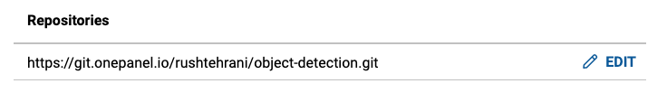
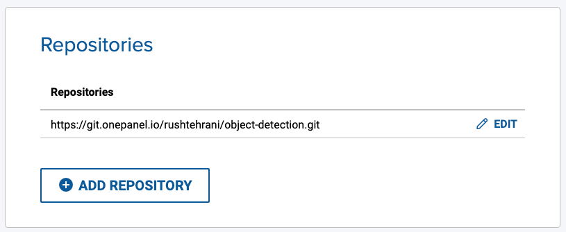

You can add and remove repositories to projects at any time. You can then add these repositories to Workspace or Jobs as you launch them.

## Local repository

!!! tip Tip
    You can identify **Local Repositories** by their domain https://git.onepanel.io

Each project comes with its own **Local Repository**, which is a Git repository managed by Onepanel. This repository is special because once you add a project member, they can automatically pull from and push to this repository instead of having to manage their credentials separately. Once you remove a member from a project, they are also removed from this repository. Other than these special properties, you can treat this repository just like your other Git repositories.

## Adding a repository
You can add Git repositories in two ways.

### Add a repository directly to a Project
1. Go to a Project and click **Settings** in the side menu or in the Project overview card.
2. Click **Repositories**.
3. Click **Add Repository**.

4. Enter the repository URL and optionally the branch name. URL format: `https://github.com/account/project.git`.

5. If this is a private repository, select **Associate with git credentials**. Select an existing or click **Add new credentials** to add and associate new credentials.

6. Click **Save**.