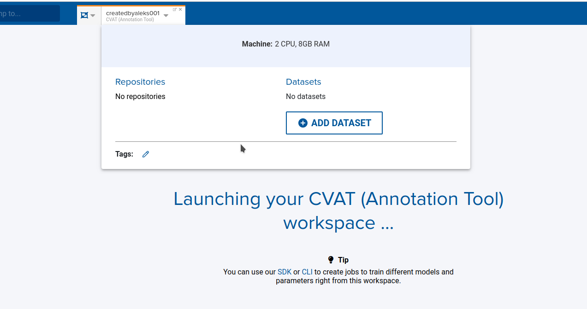
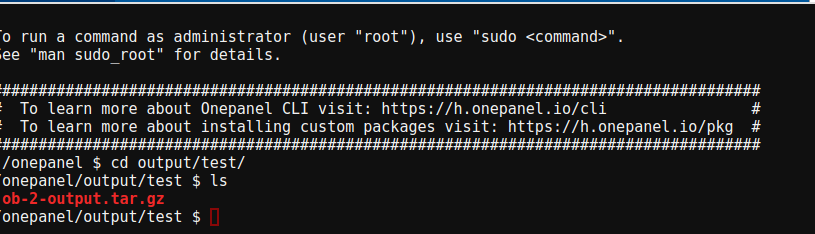
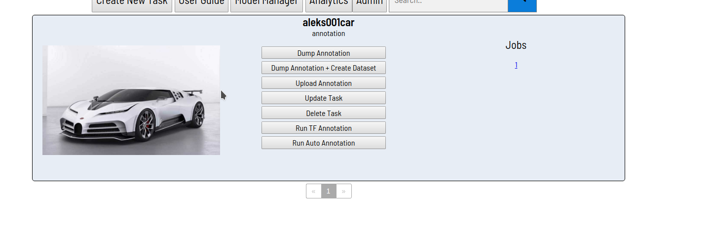

## v2.7.10 - October 23rd 2019


### Features

* Added tagging. Projects, datasets, workspaces, jobs are all now taggable!
* Workspaces and Jobs environments can now be filtered to only show the most recent versions.
* Project Repositories have been added to the Project Overview page so you can see at a glance what the project is connected to.
* Similarly, Project Datasets have been added. See what datasets are in use for a project.
* Dataset File Uploading through UI. You can now create folders and drag-and-drop files to a dataset from the UI! 
* Addition of a small tour on the Projects page to give a quick explanation on what workspaces and jobs are.
* You can now mount additional datasets while a workspace is running.

* You can now add a target directory for downloading job output, through the SDK

Example code from Jupyter Lab Notebook, TensorFlow Workspace
```jupyter
!onepanel --version
# Onepanel CLI, version 2.20.0
from onepanel.models import DatasetMount
from onepanel.models import ProjectRepository
from onepanel.sdk import Client
client = Client()
job = client.jobs.get(2, project_uid='eyeyeye')
print(job.status)
# completed
client.jobs.download_output(2, project_uid='eyeyeye', archive_flag=True, target_directory='/onepanel/output/test')
# Attempting to download the compressed output file to /onepanel/output/test directory.
# Finished downloading.
# True
```



### Alpha features

* Addition of Job Metrics. You can now use the Onepanel SDK to track metrics for jobs and see a graph summarizing them upon job completion.
* ROS + Gazebo and Unreal Engine have been added as environments. If you'd like to see a demo, contact us! More on this to come soon.

### Bug Fixes

Fixed issue where

* Job launching timer would sometimes not go down.
* Editing an environment variable in your settings wouldn't do anything
* Project code dropdown would get odd spaced styling after going to the discussions tab and back
* Error message when running more than two jobs or workspaces didn't show completely
* Public profile contact information was not private by default
* You couldn't hard refresh on a job details page.
* Dataset Files sometimes showed a NAN message in the paginators
* Viewing a public profile while logged in did not display a back button.
* Job output download archive button was hidden
* Workspace icons (pytorch, etc) were sometimes the wrong size, making them look skewed.
* Duplicate tags were allowed in the API / Backend
* User session was not properly persisting inside of cvat.
```
-- Scenario: 
Login as User A
Login to CVAT as user A. 
Log out of OnePanel as User A.
Login as User B
Go to same CVAT workspace
See User A is still logged in.
```
* Fixed header that shows the current user logged in, for workspaces
* Fixed an issue with CVAT demo not allowing demo users to create tasks inside of CVAT.
** An environment variable needs to be set.
* Added a new button to CVAT, so you can dump annotations and create a dataset in one go

* Unable to pass in no tags for a given entity
* CVAT "View Site" in Admin view, URL has been fixed
* CVAT - Assigning a task to a user causes the task to disappear from the assigner and assignee