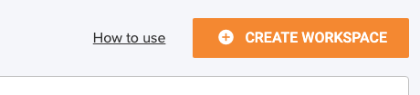
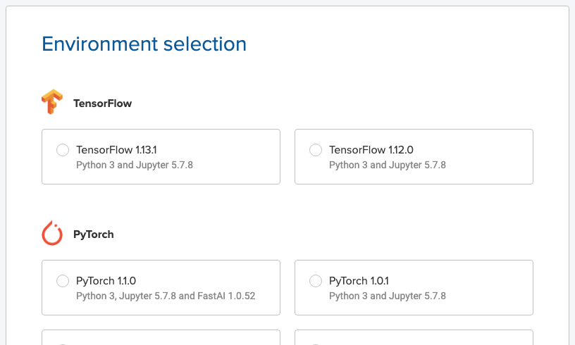
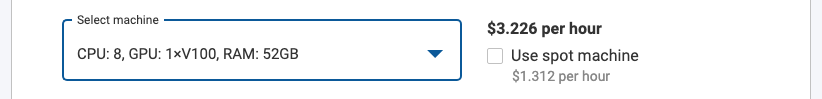
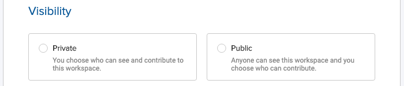
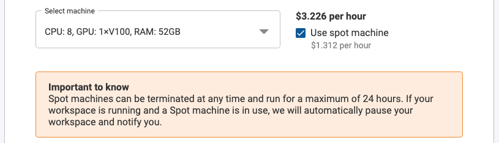
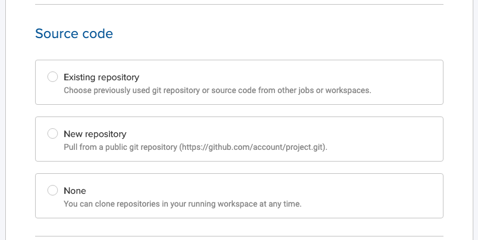
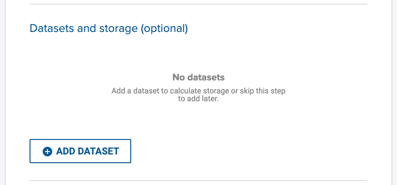
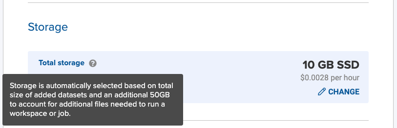

To create a workspace:

1. Go to a Project and click **Workspaces**.

2. Click **Create Workspace** in the top right corner.

3. Select an **Environment** and click **Next**.

4. Next, enter a workspace name. Workspace naming criteria are as follows:
    - 3 to 25 characters
    - Lower case alphanumeric, `-` or `_`
    - Must start and end with alphanumeric

5. Click **Select machine** to see a selection of machine types. A machine's price is displayed after you select it.

6. If you are launching this workspace in a **public** Project, you have the option to pick its **visibility**.

7. Optionally, you can select **Use spot machine** to select a [Spot Machine](machine-types/spot).

8. Select an existing or add a **Code Repository**, otherwise select **None**. The repository will be pulled into `/onepanel/code` folder. See [managing repositories](/projects/repositories/#add-a-repository-in-a-workspace-or-job) for more information.

9. Optionally, mount Datasets by clicking **Add Dataset**.

10. Optionally, change storage size by clicking **Change**. If you have selected Datasets, Onepanel will automatically adjust storage size based on total size of added Datasets plus an additional 50GB.

11. Click **Create** to create your Workspace. Depending on your machine type, this could take up to 5 minutes.

