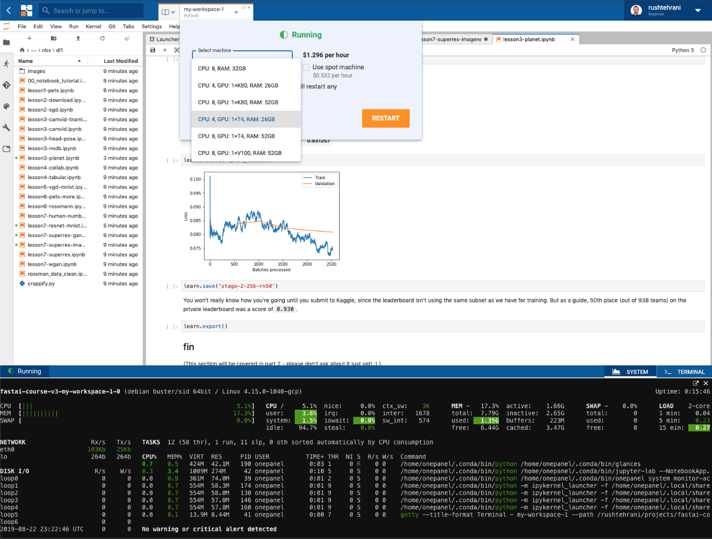

Workspaces are full Linux computing environments that come pre-installed with all the tools you need to explore data and build and experiment with your models. They include Python, JupyterLab, TensorFlow, PyTorch and other well known deep learning libraries and tools, as well as full terminal access. You can optionally [install custom packages and dependencies](environments/custom-packages) into your workspaces.

A single workspace can be [paused and resumed](/workspaces/pause-resume) at any time or be [upgraded](/workspaces/machine-types) to multiple GPUs and downgraded with ease.

