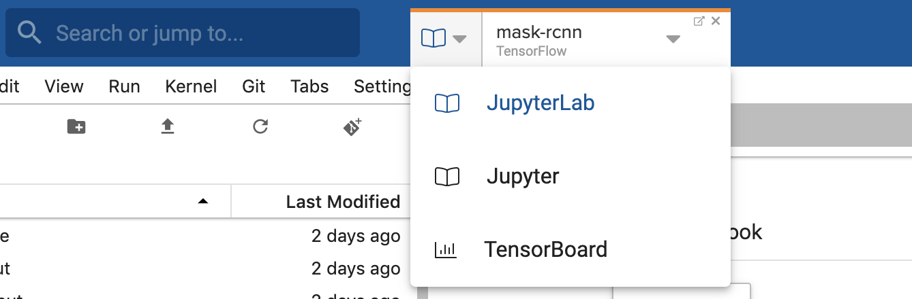
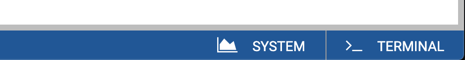
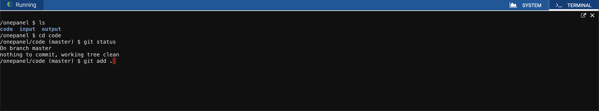
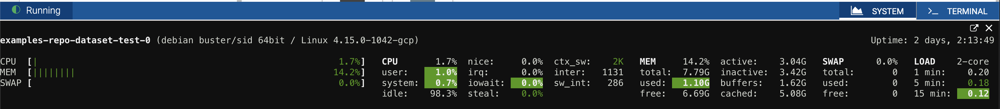

## Switch between services
You can switch between differen services by clicking the dropdown in Workspace tab. For example to switch to TensorBoard:

1. Click the Workspace tab.

2. Select the **TensorBoard** option.
3. You can open any service full screen by clicking the <i class="fa fa-external-link"></i> icon in top right corner of the tab.

## SSH access
You can access SSH through your browser in all Workspaces.

1. Click **Terminal** in bottom right corner of Workspace detail page.

2. This will expand the SSH terminal panel which will give you SSH access right through your browser.

3. You can open terminal full screen by clicking the <i class="fa fa-external-link"></i> icon in top right corner of the panel.

## System metrics
You view system metrics including CPU, GPU and memory usage by click **System** in the bottom right corner of Workspace detail page.
