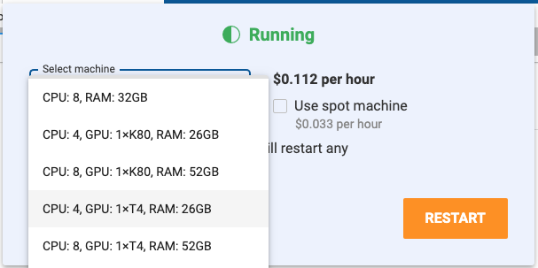

!!! note "Note"
    Switching machine types will restart your Workspace.

To switch a Workspace machine type:

1. Click the Workspace name in the active tab.

2. Click the <i class="fa fa-pencil"></i> icon next to **Machine**.

3. Choose a new machine from the drop-down and click **Restart**.
