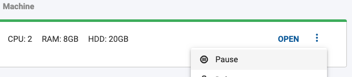
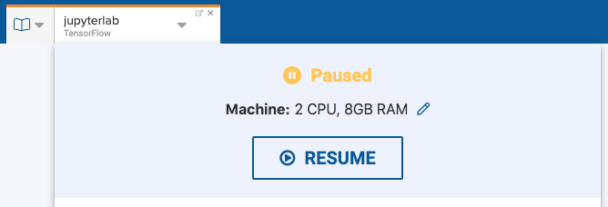
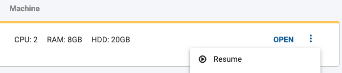

You can pause Workspaces at any time to save on compute costs. All your work remains in the Workspace for you to access at a later time when you resume your Workspace.

!!! important "Important"
    Pausing workspaces stops all CPU/GPU/Memory charges for that Workspace. You will continue to be charged for storage however.

## Pause a Workspace

You can pause a Workspace by clicking the Workspace name in active tab and clicking **Pause**.

Alternatively, you can pause a Workspace by going to **Workspaces** page in a Project and clicking the context menu for that Workspace and clicking **Pause**.

## Resume a Workspace

You can resume a paused Workspace by clicking the Workspace name in active tab and clicking **Resume**.

Alternatively, you can resume a paused Workspace by going to **Workspaces** page in a Project and clicking the context menu for that Workspace and clicking **Resume**.

